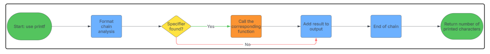

# printf - Custom printf function

#### Table of Contents

- [Description](#description)
- [Files](#files)
- [Formats](#formats)
- [Prototype](#prototype)
- [Example](#example)
- [Compilation](#compilation)
- [Output](#output)
- [Return](#return)
- [Flowchart](#flowchart)
- [Authors](#authors)

#

#### Description

This project is about creating a `printf` function that will be able to print any string with the correct format.

#### Version

- `1.0.0` - *Initial Release* - 2025-03-27

#

#### Files

| File | Description | Link |
| ---- | ----------- | ---- |
| `main.h` | Header file with prototypes | [main.h](./main.h) |
| `_printf.c` | Main function | [_printf.c](./_printf.c) |
| `printf_char.c` | Function to print a character | [printf_char.c](./printf_char.c) |
| `printf_str.c` | Function to print a string | [printf_str.c](./printf_str.c) |
| `printf_percent.c` | Function to print a percent sign | [printf_percent.c](./printf_percent.c) |
| `printf_int.c` | Function to print an integer | [printf_int.c](./printf_int.c) |
| `printf_binary.c` | Function to print a binary number | [printf_binary.c](./printf_binary.c) |

#### Formats

| Format | Description | Using | Output |
| ------ | ----------- | ------- | ------ |
| `%c` | Character | ```c printf("%c", 'H');``` | H |
| `%s` | String | ```c printf("%s", "Hello, World!");``` | Hello, World! |
| `%%` | Percent sign | ```c printf("%%");``` | % |
| `%d` | Integer | ```c printf("%d", 100);``` | 100 |
| `%i` | Integer | ```c printf("%i", 100);``` | 100 |
| `%b` | Integer | ```c printf("%b", 98);``` | 1100010 |

#### Prototype

```c
int _printf(const char *format, ...);
```

#### Example

```c
#include "holberton.h"

int main(void)
{
	int len;

	len = _printf("Hello, World!\n");
	_printf("Length: %d\n", len);

	return (0);
}
```

#### Compilation

```bash
$ gcc -Wall -Werror -Wextra -pedantic -std=gnu89 -I. *.c
```

#### Output

```bash
Hello, World!
Length: 14
```

#### Return

- On success, the total number of characters written is returned.
- On error, a negative number is returned.

#### Flowchart



#

#### Authors &copy;

- **Martin Clement** - [GitHub Profile](https://github.com/ItsZmainDev)
- **Terence Tengue** - [GitHub Profile](https://github.com/Terencetjt26)
